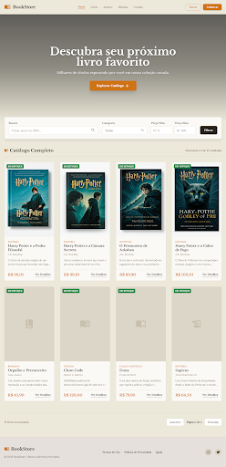

# BookStore Home Light Mode - Stitch Export

> [!NOTE]
> Exportado do Stitch MCP - Projeto ID: `13549748187226338840`
> Screen ID: `4ff927c072d94e41a2c21d35827aeb57`

---

## 🖼️ Preview

---

## 📐 Dimensões

- **Largura:** 2560px
- **Altura:** 5288px
- **Device:** Desktop

---

## 🎨 Tema

| Propriedade  | Valor      |
| ------------ | ---------- |
| Color Mode   | Light      |
| Font         | Noto Serif |
| Roundness    | 8px        |
| Custom Color | #cf7317    |
| Saturation   | 2          |

---

## 📄 Estrutura da Página

### Header

- Logo: **BookStore** com ícone de livro
- Navegação: Home, Livros, Autores, Editoras, Contato
- Ações: Botões "Entrar" e "Cadastrar"

### Hero Banner

- Título: "Descubra seu próximo livro favorito"
- Subtítulo: "Milhares de títulos esperando por você em nossa coleção curada"
- Seção: "Catálogo Completo"

### Grid de Livros (8 cards)

| Título                           | Autor             |
| -------------------------------- | ----------------- |
| Harry Potter e a Pedra Filosofal | J.K. Rowling      |
| Harry Potter e a Câmara Secreta  | J.K. Rowling      |
| O Prisioneiro de Azkaban         | J.K. Rowling      |
| Harry Potter e o Cálice de Fogo  | J.K. Rowling      |
| Orgulho e Preconceito            | Jane Austen       |
| Clean Code                       | Robert C. Martin  |
| Duna                             | Frank Herbert     |
| Sapiens                          | Yuval Noah Harari |

### Footer

- © 2026 BookStore. Todos os direitos reservados.
- Links: Termos de Uso, Política de Privacidade, Ajuda
- Redes Sociais: Instagram, Twitter

---

## 🔗 Links do Stitch

- **Download HTML:** [Clique aqui](https://contribution.usercontent.google.com/download?c=CgthaWRhX2NvZGVmeBJ8Eh1hcHBfY29tcGFuaW9uX2dlbmVyYXRlZF9maWxlcxpbCiVodG1sX2RiMTA5NGJhNmY1ZDQxNjk4YjRjOTcxOTk2ZmRiMGU0EgsSBxCEutyYpgYYAZIBJAoKcHJvamVjdF9pZBIWQhQxMzU0OTc0ODE4NzIyNjMzODg0MA&filename=&opi=96797242)
